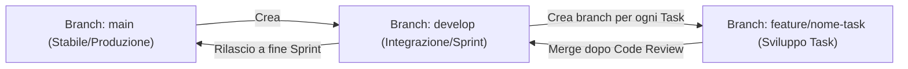
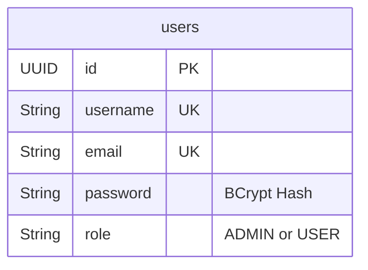
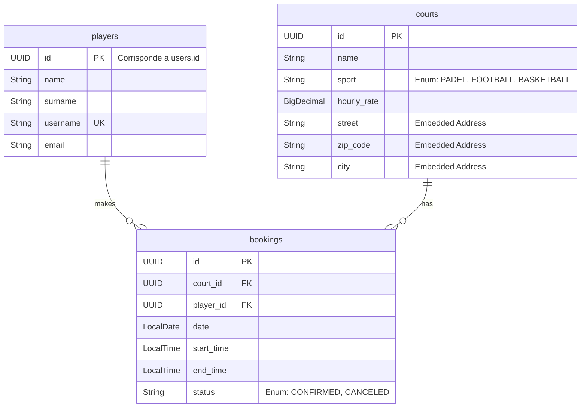
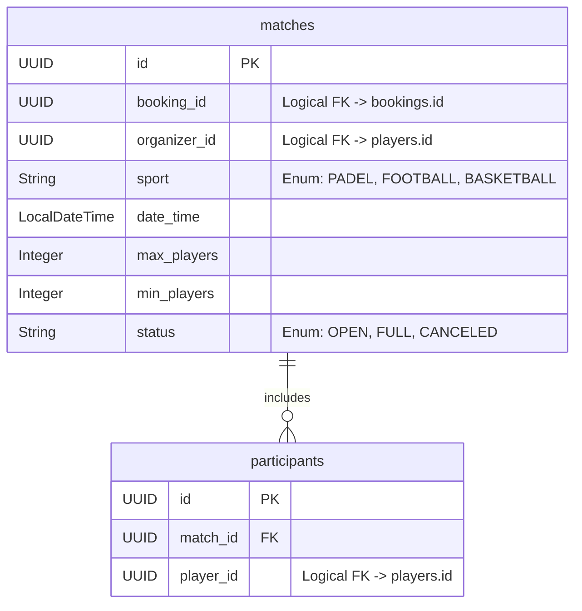

# SportFlow: Step-by-Step Mentorship

Abbiamo concordato di usare la struttura **Mono-repo (Multi-modulo Maven)**. 
Procederemo **un singolo passo alla volta**, decidendo insieme come avanzare.

---

## 🤝 Regole di Collaborazione (Rules of Engagement)

1. **L'assistente (Senior/Manager/Architect) NON scrive mai codice di progetto**: L'utente scrive ogni singola riga di codice, gestisce i file e l'IDE.
2. **Nessun codice Java in chat (No-Code Policy)**: L'assistente **non deve fornire codice Java** (classi, entità, servizi, controller) nella chat, a meno che l'utente non lo richieda esplicitamente per spiegazioni o dubbi. L'assistente descriverà i requisiti a parole o tramite pseudo-codice ad alto livello.
3. **Template per Configurazioni**: L'assistente può fornire template pronti in chat solo per file di configurazione standard e boilerplate (es. `.gitignore`, `pom.xml`, `docker-compose.yml`, configurazioni di database).
4. **Workflow orientato ai Task**: L'assistente si limita ad assegnare il task corrente dal backlog.
5. **Lingua del Workflow (Conventional Commits con Descrizione in Italiano)**: 
   * I messaggi di commit, le issue e i branch avranno la descrizione in **italiano**, ma manterranno i prefissi e i tag convenzionali standard in **inglese** (es. `feat: ...`, `chore: ...`, branch `feature/...`, `chore/...`).
   * Il codice sorgente Java e il database restano interamente in **inglese**.

---

## 📍 Progetto Selezionato: **SportFlow**
Una piattaforma per la **prenotazione di campi sportivi (calcetto, padel, basket)** e l'**organizzazione di partite**.

### Architettura dei Microservizi Target:
* **`auth-service`**: Gestisce gli utenti, le credenziali e rilascia i token JWT.
* **`booking-service`**: Gestisce i campi sportivi e le prenotazioni (contiene una replica leggera degli utenti).
* **`match-service`**: Gestisce le partite pubbliche, le squadre e le adesioni dei giocatori.
* **`notification-service`**: Gestisce l'invio asincrono di email/SMS.

---

## 🌲 Strategia dei Branch Git (Branching Strategy)

Per gestire il codice come in un vero team di sviluppo, utilizzeremo una versione semplificata di Git Flow:



### I nostri Branch:
1. **`main`**: Il branch principale. Contiene solo il codice stabile e "rilasciato". Non si committa mai direttamente su `main` (tranne il commit iniziale).
2. **`develop`**: Il branch di sviluppo attivo per lo Sprint corrente.
3. **`feature/nome-task`**, **`chore/nome-task`**, **`bugfix/nome-task`**: Branch temporanei per i singoli compiti.

---

## 📂 Struttura del Repository (Folder Structure)

```text
sportflow/                       <-- Root (Cartella principale e repo Git)
 ├── .git/                       <-- File di tracciamento Git
 ├── .gitignore                  <-- Configurazione dei file da ignorare
 ├── pom.xml                     <-- POM Padre (gestisce le dipendenze globali)
 ├── docker-compose.yml          <-- Configurazione dei container (PostgreSQL, ecc.)
 ├── booking-service/            <-- Sottomodulo 1 (Sprint 1)
 │    ├── pom.xml                <-- POM Figlio di booking-service
 │    └── src/
 │         ├── main/
 │         │    ├── java/com/sportflow/booking/  <-- Codice Java (Entities, Services, Controllers)
 │         │    └── resources/
 │         │         ├── application.yml         <-- Configurazione del microservizio
 │         │         └── db/migration/           <-- Migrazioni Flyway (file .sql)
 │         └── test/                             <-- Test automatici (scritti dal Senior)
 ├── auth-service/               <-- Sottomodulo 2 (Sprint 3)
 └── match-service/              <-- Sottomodulo 3 (Sprint 4)
```

---

## 🛠️ Stack Tecnologico e Strumenti (Tooling)
* **Java 21 (LTS)** & **Spring Boot 3.3.x**
* **Maven (Multi-modulo)**
* **PostgreSQL** & **Spring Data JPA**
* **Flyway** (Gestione migrazioni database via SQL)
* **Docker & Docker Compose**
* **Git, GitHub & Postman**

---

## 🗺️ Il Piano degli Sprint (Release Roadbook)

### 🏁 Sprint 1: Le Fondamenta (Il Booking Base)
* **Focus**: Configurazione multi-modulo Maven, design del database relazionale, JPA e relazioni, migrazioni con Flyway, API REST base, Postman.
* **Database**: `sportflow_booking` (PostgreSQL).
* **Servizi attivi**: Solo `booking-service` (stand-alone temporaneo).

### ⚙️ Sprint 2: Logica Complessa e Concorrenza (Il Booking Reale)
* **Focus**: Calcolo dinamico di slot ed orari, gestione transazionale in Java/Spring, Lock del database (pessimistici/ottimistici) per gestire l'alta concorrenza ed evitare l'overbooking dello stesso campo.

### 🔒 Sprint 3: Sicurezza e Identità (`auth-service`)
* **Focus**: Creazione del secondo microservizio **`auth-service`** con database dedicato (`sportflow_auth`). Registrazione utenti, hashing password, generazione Token JWT. Configurazione di Spring Security in `booking-service` per validare i token JWT ed effettuare l'autorizzazione basata sui ruoli (Admin vs Giocatore).

### 🤝 Sprint 4: Il Terzo Microservizio (Il Matchmaking)
* **Focus**: Creazione del microservizio **`match-service`** con database dedicato. Comunicazione sincrona tra microservizi tramite OpenFeign o WebClient.

### ✉️ Sprint 5: Comunicazione Asincrona ed Eventi (Message Broker)
* **Focus**: Integrazione di un Message Broker (RabbitMQ o Kafka) e creazione di **`notification-service`**. Invio di notifiche asincrone in base agli eventi di sistema.

### 🐳 Sprint 6: Dockerizzazione e Deployment Locale
* **Focus**: Scrittura di file `docker-compose.yml` multi-container per avviare l'intera architettura in locale.

---

## 🗄️ Modello Dati Approvati (Inglese)

### 1. Database: `sportflow_auth` (`auth-service`)


### 2. Database: `sportflow_booking` (`booking-service`)


### 3. Database: `sportflow_match` (`match-service`)

